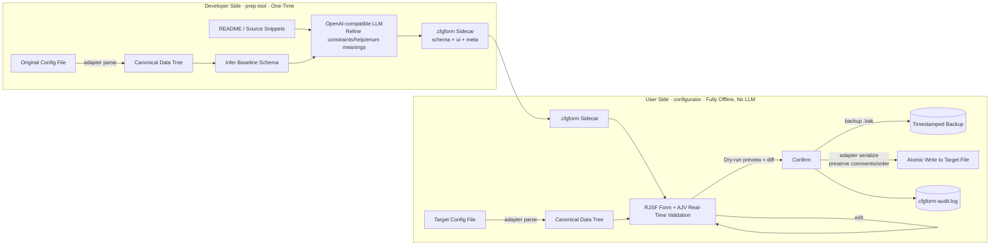

> 🌐 [中文](README.md) ｜ **English**

# CfgForm (Configuration Form Builder / JSON Configurator)

> **English summary:** **CfgForm** is a pair of tiny, offline-first desktop apps (Tauri v2 + React 19 + RJSF + AJV) that turn raw config files into safe, validated, human-friendly forms. A **developer-side generator** (`prep-tool`) reads your README/source with your own OpenAI-compatible LLM key to produce one `.cfgform` sidecar (a format-neutral schema + UI + provenance metadata) — it **never** modifies your original config. A **user-side editor** (`configurator`) is **100% offline, contains no LLM**, renders that sidecar as a live-validated form, and saves with a two-step Dry-run preview, timestamped backup, atomic write, and a plain-language audit log. Supports JSON, .env, TOML, INI, YAML, and Docker Compose. The scarce value is the **semantic understanding layer**: structure + constraints + the author's intent, decoupled from the file's serialization shell.

**CfgForm is a pair of tiny, offline-first desktop tools that turn "can't read, dare not touch" config files into visual forms with explanations, real-time validation, and instant error hints.**

<!-- Badge placeholders: replace with real links before release -->


---

## Screenshots

| User side · `configurator` (offline editor) | Developer side · `prep-tool` (generator) |
| --- | --- |
|  |  |

---

## What Problem Does This Solve

Configuration files are the "gateway" to nearly all software, yet two real problems persist:

1. **The author's intent is never spelled out**: what a field accepts, its valid range, why it must be HTTPS, what business meaning an enum value carries — this knowledge lives in the author's head, in the README, in issue replies, **anywhere but the config file itself**. Beginners can't figure it out; veterans find it noisy.
2. **Format errors are trivially easy**: a missing JSON bracket, a YAML indentation slip, a `.env` with a BOM, an unclosed quote… A non-technical user editing a config often ends with "the program won't start," imposing massive support cost on the author.

No existing tool simultaneously delivers **offline + lightweight + schema-driven + non-technical-friendly + zero-config + universal**. CfgForm exists to fill that gap.

---

## Core Concept: Configuration Understanding Layer + `.cfgform` Sidecar

CfgForm is not "yet another JSON editor" — it is a **universal configuration understanding and safe-editing layer**:

- **The file format is merely a serialization shell**. What is truly scarce, reusable, and worth preserving is the **semantic annotation layer** — structural constraints (schema) + human-readable hints (ui) + authorial intent (meta).
- This semantic layer is packaged into a **single `.cfgform` sidecar file** (its content is JSON, but it is **format-agnostic**). It lives in the **same directory as the target config file, paired by filename append**:

  | Target File | Sidecar File |
  | --- | --- |
  | `config.json` | `config.json.cfgform` |
  | `.env` | `.env.cfgform` |
  | `docker-compose.yml` | `docker-compose.yml.cfgform` |

- The sidecar is only recognized by this ecosystem — it **does not pollute or confuse** regular users; the target file **always keeps its original name and form**, and edits are written back to the same file, never renamed.

This is CfgForm's moat: `.cfgform` sidecars can be shared across the ecosystem, accumulated into a built-in schema library, paying the cost of "understanding a config" once and benefiting indefinitely.

---

## How It Works

The core design iron rule is a **format-agnostic core**: rendering, validation, audit trails, and backups are identical across all formats; all format differences are isolated within **format adapters**. Any file is first parsed by its adapter into a **canonical data tree** (a neutral JSON value), after which everything operates on that tree.



Plain-text data flow (for reading without a Mermaid renderer):

```
Original Config File (bytes)
   └─ format adapter parse ─▶ Canonical Data Tree (serde_json::Value)
                                   ├─▶ schema + ui (from .cfgform sidecar)
                                   └─▶ RJSF Form ──edit──▶ Validate (AJV) ──▶ Canonical Data Tree'
Canonical Data Tree'
   └─ format adapter serialize (best-effort preserve comments/key order/format) ─▶ text (bytes)
        └─ atomic write (temp file → rename) ─▶ write back to original file itself
```

> For the complete design philosophy, canonical data tree, adapter extension points, and technical decision rationale, see **[docs/ARCHITECTURE.md](docs/ARCHITECTURE.md)**.

---

## Two Programs (Role Comparison)

| Dimension | `configurator` (User-Side Editor) | `prep-tool` (Developer-Side Generator) |
| --- | --- | --- |
| Target audience | End users (no coding required) | Developers / authors |
| Network access | **100% offline** | One-time LLM request only (developer's own key) |
| Contains LLM | **No** | Yes (OpenAI-compatible) |
| Core action | Read `.cfgform` → render form → validate → safe save | Parse config + read README/source → generate `.cfgform` sidecar |
| Modifies original file | Yes (edits written back to original file itself, original name and form, backed up first) | **Never modifies original file**, only produces sidecar |
| Run frequency | Every time a user edits config | One-time by author (re-run when config structure changes) |
| Key safety | Dry-run two-step save + backup + atomic write + audit log | Three-tier key priority; never written to disk/log/sidecar |

See [`configurator/README.md`](configurator/README.md) and [`prep-tool/README.md`](prep-tool/README.md) for details on each app.

---

## Supported Formats (Fidelity Matrix · Honestly Reported)

> Lossless round-tripping is part of "data transparency" — we never exaggerate. ⚠️ items have their specific limitations documented; always inspect the Dry-run preview before saving.

| format | target example | load | save | comment preservation | key order | notes |
| --- | --- | :---: | :---: | --- | --- | --- |
| `json` | `config.json` | ✅ | ✅ | — (JSON has no comments) | ✅ preserves object key order | 2-space indent, UTF-8 no BOM, `\n` line endings |
| `env` | `.env` | ✅ | ✅ | ✅ | ✅ | Line-level: only changed lines rewritten; comments/blank lines/order preserved; new keys appended at end |
| `toml` | `app.toml` | ✅ | ✅ | ✅ | ✅ | `toml_edit` surgical lossless |
| `ini` | `*.ini/*.conf/*.properties` | ✅ | ✅ | ✅ | ✅ | Line-level preservation; new root keys at top, new section keys at end |
| `yaml` | `*.yml/*.yaml` | ✅ | ✅ (value edits) | ✅ preserved | ✅ preserved | Surgical line-level rewrite: editing existing scalars preserves comments/anchors/order; only **deep nested key add/remove or type change** falls back to full document normalization (with correctness self-check safety net — data never incorrect) |
| `compose` | `docker-compose.yml` | ✅ | ✅ (value edits) | ✅ preserved | ✅ preserved | Reuses the improved yaml adapter; same limitations as above |

---

## Features

| Feature | Status | Description |
| --- | --- | --- |
| Multi-format adapters (json/env/toml/ini/yaml/compose) | ✅ | Format differences isolated in adapters; core is unified |
| RJSF form + AJV real-time validation | ✅ | Required-field red asterisks, Chinese error summary |
| Conditional / cross-field validation (`if/then/else`, `dependencies`) | ✅ | Native JSON Schema capability, executed by AJV (e.g., `https` required when `mode=prod`) |
| Secret masking `ui:secret` | ✅ | Password field + show/hide toggle; value never logged, never in sidecar, preview masked by default |
| Author read-only lock `ui:readOnly` | ✅ | Field greyed out, disabled, labeled "Author Locked" |
| Default value diff highlighting + per-field reset | ✅ | Based on `schema.default` |
| Dry-run two-step save | ✅ | Preview "will-be-written content + line-level diff" first, only persist on confirmation |
| Backup + atomic write + audit trail | ✅ | Timestamped `.bak`, temp file → rename, `cfgform-audit.log` |
| Multi-environment profiles | ✅ | Top-bar environment switcher; effective value = base ⊕ `overrides[active]`; save writes back to single target file; "Save current edits as this environment override" writes to sidecar |
| Built-in schema auto-matching | ✅ | Built-in templates for `package.json`/`tsconfig.json`/`docker-compose.yml`; when a matching file in directory has no sidecar, auto-apply with "Built-in Library" label |

---

## Quick Start

### Prerequisites

- **Node.js 18+** (frontend build: tsc + Vite)
- **Rust (stable; MSVC toolchain on Windows)** (Tauri backend: `cargo`)
- **WebView2 Runtime** (pre-installed on Windows 10/11)

### Recommended Workflow (Developer → User)

**Step 1 (Developer, one-time): Use `prep-tool` to generate a `.cfgform` sidecar**

```pwsh
cd prep-tool
npm install
npm run tauri dev          # Launch the developer-side generator
```

In the UI: select a target config file → auto-detect format and tech stack → configure LLM (bring your own OpenAI-compatible Key/BaseURL/Model; **default recommended: DeepSeek `https://api.deepseek.com`, default model `deepseek-chat`** — endpoint/model are editable, and you can enter a stronger DeepSeek "pro" model if you have one) → generate and preview → write `<target-filename>.cfgform`. The original config file is **never modified**. The non-secret Base URL/Model can be saved to `settings.json` in the user config dir and auto-filled on next launch (it never contains the key).

**Step 2 (User): Use `configurator` to safely edit**

```pwsh
cd configurator
npm install
npm run tauri dev          # Dev mode: scans the current working directory
```

Or, after building, place the executable in the config file's directory and double-click to run. It scans the same directory for `*.cfgform` (backward-compatible with legacy `*.jsonform`) → renders the form → validates in real time → **Dry-run preview → confirm → backup → atomic write**.

> Want to try it immediately? Use the `sample/` directory in this repo: `configurator` dev mode defaults to scanning the current working directory; point it at `sample/` to see real paired examples in 4 formats. See [`sample/README.md`](sample/README.md).

---

## Building from Source

The two apps share the same structure; build each independently:

```pwsh
# Prerequisites: Node 18+, Rust stable (MSVC), WebView2
cd configurator               # or cd prep-tool
npm install                   # Install frontend dependencies

# If cargo is not on PATH (first-hand experience), inject it first:
$env:PATH = "$env:USERPROFILE\.cargo\bin;$env:PATH"

npm run tauri dev             # Dev mode (hot-reload desktop window)

# Production build (must use Tauri CLI! See warning below)
npx tauri build               # Produces exe + installer package
npx tauri build --no-bundle   # Produces standalone exe only (skips installer, faster)
```

> ⚠️ **Always use `tauri build` for production, never raw `cargo build`**: `cargo build` does not embed the frontend into the executable; the resulting binary will try to connect to the dev server at `http://localhost:1420`, causing a **white screen → "localhost refused to connect"**. Only `tauri build` packages the frontend and loads it via the `tauri://` protocol.

Build artifact paths:

```
<app>/src-tauri/target/release/configurator.exe   # Self-contained double-clickable exe (no installer needed if WebView2 is installed)
<app>/src-tauri/target/release/bundle/             # .msi / .exe installer packages produced by tauri build
```

> **Windows build note (first-hand verified)**: If a cygwin/MinGW `link.exe` exists on PATH, it will shadow the MSVC linker and cause link failures. Build inside a **VS Developer environment**:
> ```pwsh
> $vs = & "${env:ProgramFiles(x86)}\Microsoft Visual Studio\Installer\vswhere.exe" -latest -property installationPath
> Import-Module (Join-Path $vs "Common7\Tools\Microsoft.VisualStudio.DevShell.dll")
> Enter-VsDevShell -VsInstallPath $vs -DevCmdArguments "-arch=x64" -SkipAutomaticLocation
> $env:PATH = "$env:USERPROFILE\.cargo\bin;$env:PATH"
> npx tauri build --no-bundle   # Run inside configurator/ or prep-tool/ directory
> ```

**Verification status (first-hand tested)**: Both apps pass `npm run build` (0 TS errors) and `cargo check` (0 errors), and have completed release builds via **Tauri CLI (`tauri build --no-bundle`)**, producing self-contained double-clickable executables — `configurator.exe` ≈ 10.0 MB, `prep-tool.exe` ≈ 12.5 MB (within the ~5–15 MB target, instant startup, works offline).

> 📦 For installer (NSIS/MSI, bootstraps WebView2) packaging and Windows/macOS/Linux three-platform builds, see **[docs/DISTRIBUTION.md](docs/DISTRIBUTION.md)**. Note: **only the standalone exes were verified in this project so far**; installers are a documented capability (local `tauri build` or via GitHub Actions CI) and were not produced in this project's validation.

---

## Data Transparency & Privacy

- **User-side `configurator` is 100% offline**, contains no LLM, and makes no network requests.
- The sole network request happens in **`prep-tool`**: a single call to the developer-configured OpenAI-compatible `/chat/completions` endpoint (**default recommended: DeepSeek `https://api.deepseek.com`**), for generating schema/ui.
- **Keys are never written to disk, logs, or `.cfgform`**; `ui:secret` field values never appear in the audit log, and the preview masks them by default.
- For a complete per-app "what is read / written / sent / never exfiltrated" checklist, audit log samples, key three-tier priority, and backup strategy, see **[docs/PRIVACY.md](docs/PRIVACY.md)**.

---

## Directory Structure

```
CfgForm/
├─ README.md                  # This file (GitHub landing page)
├─ LICENSE                    # PolyForm Noncommercial 1.0.0 (free for noncommercial use)
├─ COMMERCIAL.md / COMMERCIAL.en.md  # Commercial licensing (paid license for commercial use)
├─ .gitignore
├─ CONTRIBUTING.md            # Contribution guide (incl. "How to add a format adapter")
├─ spec/
│  └─ cfgform-spec.md         # ★ Single source of truth: .cfgform sidecar spec v2.1
├─ docs/
│  ├─ ARCHITECTURE.md         # Design philosophy / technical decisions
│  ├─ PRIVACY.md              # Data transparency & privacy
│  └─ DISTRIBUTION.md         # Building & cross-platform distribution
├─ configurator/              # User-side editor (Tauri v2 + React 19, offline, no LLM)
│  ├─ src/                     # React frontend
│  └─ src-tauri/src/
│     ├─ lib.rs                # scan/load/preview/save/audit commands
│     └─ adapters.rs           # Format parse/serialize adapters
├─ prep-tool/                 # Developer-side generator (Tauri v2 + React 19 + LLM)
│  └─ src-tauri/src/lib.rs     # detect/parse/infer/LLM generate/write sidecar commands
├─ sample/                    # Runnable multi-format paired demos
└─ schemas/                   # Built-in schema library (ready-to-copy .cfgform templates)
```

---

## Specification

The field definitions, naming conventions, format adapter contracts, per-format fidelity, bilateral behavioral contracts, and safety red lines of the `.cfgform` sidecar are **all governed by [`spec/cfgform-spec.md`](spec/cfgform-spec.md) (document revision v2.1) as the single source of truth**. Any code or documentation change must update the spec first. (Note: the `$cfgform` field value inside a sidecar is the format-compatibility version `"2.0"`, written by code, intentionally distinct from the spec document revision number.)

---

## Roadmap

**Completed**

- Format-agnostic core + 6 format adapters (json/env/toml/ini/yaml/compose)
- `.cfgform` append-pairing (backward-compatible with legacy `.jsonform`)
- Secret masking, read-only lock, default value reset, conditional/cross-field validation
- Dry-run two-step save, backup, atomic write, Chinese audit log
- prep-tool LLM-assisted generation + secret heuristic forced annotation
- **Multi-environment profiles fully implemented** (`overrides` application + write-back to sidecar)
- **Built-in schema library auto-matching** (package.json / tsconfig / docker-compose)
- **YAML/compose surgical write-back** (editing existing values preserves comments/anchors/order + correctness self-check safety net)
- Both apps produce release self-contained exes (configurator ≈ 10.0 MB, prep-tool ≈ 12.5 MB)

**Planned**

- More formats (e.g., `*.properties` enhancement, HCL, XML exploration)
- Format-preserving improvements for YAML deep structural add/remove (eliminate full-document fallback)
- Array drag-to-reorder, dark theme, config template presets
- Expand the built-in schema library with more entries by "tech stack"

---

## Contributing

Contributions of format adapters, built-in schema library entries, documentation, and bug fixes are welcome. Please read **[CONTRIBUTING.md](CONTRIBUTING.md)** first: it covers dev environment setup, "How to add a format adapter" extension-point steps, build/verification commands, and the PR process.

---

## License

This project is released under the **[PolyForm Noncommercial License 1.0.0](LICENSE)**: **free for noncommercial use** (personal research/study/experiment, hobby projects, charitable/educational/research/government institutions, etc.).

**Any commercial use requires a separate paid commercial license from the author** (selling, using in a for-profit product/service, internal business use beyond evaluation, etc.). See **[COMMERCIAL.md](COMMERCIAL.md)** for commercial licensing; specific terms and fees are by agreement.

© 2026 长沙市果垂素宇工程设计有限公司

> Note: the copyright holder name `长沙市果垂素宇工程设计有限公司`, the year `2026`, and the contact email placeholder `<your-contact-email>` in [COMMERCIAL.md](COMMERCIAL.md) can all be replaced with your own information as needed.

---

Change log: 2026-06-20 Completed v2.0 — format-agnostic core + 6 format adapters, `.cfgform` spec, secret masking/read-only/default reset/conditional validation/Dry-run save/audit trail, prep-tool LLM generation, complete docs+samples+schema library; `configurator` builds via release linking to a ≈10.0 MB self-contained exe.

Change log: 2026-06-21 Doc-accuracy pass — spec document revision unified to v2.1 (the sidecar `$cfgform` field value remains `"2.0"`); exe sizes unified to configurator ≈ 10.0 MB / prep-tool ≈ 12.5 MB; clarified the DeepSeek default endpoint/model and prep-tool's non-secret `settings.json` persistence; added a docs/DISTRIBUTION.md pointer and clarified that only standalone exes were verified so far.

Change log: 2026-06-22 License switched from MIT to PolyForm Noncommercial License 1.0.0 (free for noncommercial use, paid license required for commercial use), copyright holder 长沙市果垂素宇工程设计有限公司; added COMMERCIAL.md / COMMERCIAL.en.md commercial licensing docs, updated the license badge and directory note, README zh/en kept in sync.
