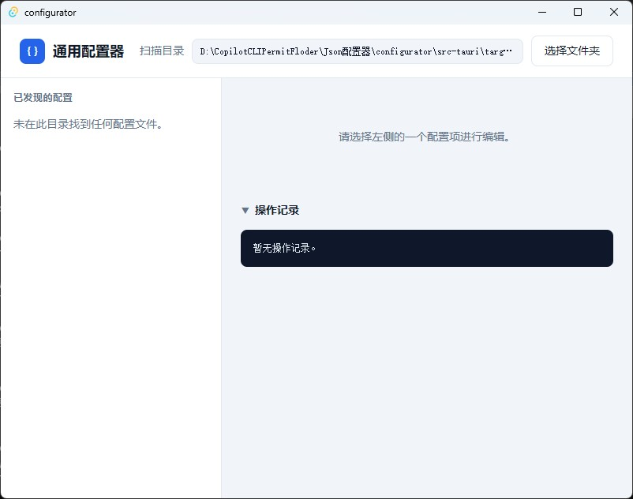
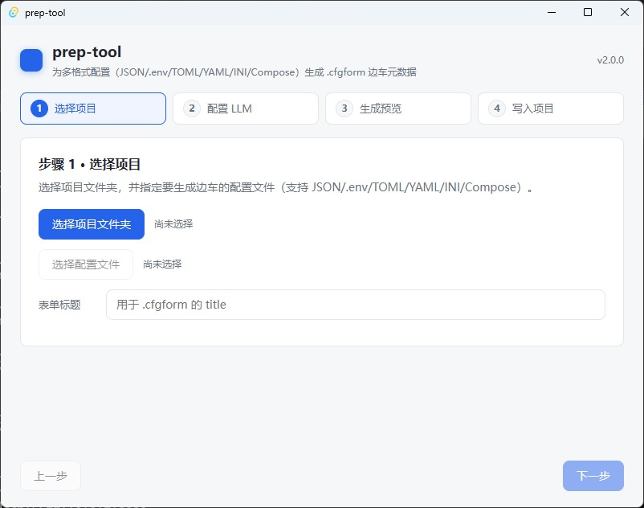
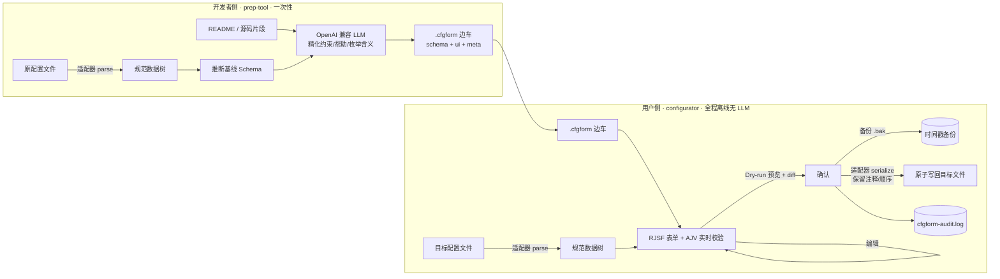

> 🌐 **中文** ｜ [English](README.en.md)

# CfgForm（配置表单器 / JSON 配置器）

> **English summary:** **CfgForm** is a pair of tiny, offline-first desktop apps (Tauri v2 + React 19 + RJSF + AJV) that turn raw config files into safe, validated, human-friendly forms. A **developer-side generator** (`prep-tool`) reads your README/source with your own OpenAI-compatible LLM key to produce one `.cfgform` sidecar (a format-neutral schema + UI + provenance metadata) — it **never** modifies your original config. A **user-side editor** (`configurator`) is **100% offline, contains no LLM**, renders that sidecar as a live-validated form, and saves with a two-step Dry-run preview, timestamped backup, atomic write, and a plain-language audit log. Supports JSON, .env, TOML, INI, YAML, and Docker Compose. The scarce value is the **semantic understanding layer**: structure + constraints + the author's intent, decoupled from the file's serialization shell.

**CfgForm 是一对极小、离线优先的桌面工具，让"看不懂、不敢改"的配置文件，变成带说明、能实时校验、改错就提示的可视化表单。**

<!-- 徽章占位：发布前替换为真实链接 -->


---

## 界面预览

| 用户侧 · `configurator`（离线编辑器） | 开发者侧 · `prep-tool`（生成器） |
| --- | --- |
|  |  |

---

## 解决什么痛点

配置文件几乎是所有软件的"门槛"，却长期存在两个真实问题：

1. **作者意图没说清**：一个字段到底填什么、范围多少、为什么必须是 HTTPS、这个枚举值代表什么业务含义——这些知识在作者脑子里、在 README 里、在 Issue 回复里，**唯独不在配置文件本身**。小白看不懂，老手也嫌乱。
2. **格式极易出错**：JSON 少个括号、YAML 缩进错位、`.env` 编码带 BOM、引号没闭合……非技术用户改一次配置往往以"程序起不来"收场，给作者带来大量支持成本。

现有工具无法同时满足「离线 + 轻量 + Schema 驱动 + 非技术友好 + 零配置 + 通用」。CfgForm 正是为填补这个空白而生。

---

## 核心理念：配置理解层 + `.cfgform` 边车

CfgForm 的本质不是"又一个 JSON 编辑器"，而是一个**通用配置理解与安全编辑层**：

- **文件格式只是序列化外壳**。真正稀缺、可复用、值得沉淀的是那层**语义说明**——结构约束（schema）+ 人话提示（ui）+ 作者意图（meta）。
- 这层语义被封装进**单个 `.cfgform` 边车文件**（内容是 JSON，但**格式无关**）。它与目标配置文件**同目录、按文件名追加配对**：

  | 目标文件 | 边车文件 |
  | --- | --- |
  | `config.json` | `config.json.cfgform` |
  | `.env` | `.env.cfgform` |
  | `docker-compose.yml` | `docker-compose.yml.cfgform` |

- 边车只被本生态识别，**不污染、不困扰**普通用户；目标文件**永远原名原样**，编辑后写回自身，绝不改名。

这就是 CfgForm 的护城河：`.cfgform` 边车可被生态共享、可沉淀为内置 schema 库，把"理解一个配置"的成本一次性付清、长期受益。

---

## 它是如何工作的（原理）

核心设计铁律是**格式无关核心**：渲染、校验、留痕、备份对所有格式完全一致；格式差异全部隔离在「格式适配器」里。任何文件，先被适配器解析成一棵**规范数据树**（中立的 JSON 值），之后的一切都基于这棵树。



纯文本数据流（无 Mermaid 渲染环境时阅读）：

```
原配置文件(bytes)
   └─ 格式适配器 parse ─▶ 规范数据树(serde_json::Value)
                              ├─▶ schema + ui（来自 .cfgform 边车）
                              └─▶ RJSF 表单 ──编辑──▶ 校验(AJV) ──▶ 规范数据树'
规范数据树'
   └─ 格式适配器 serialize（尽力保留注释/键顺序/格式）─▶ 文本(bytes)
        └─ 原子写入（临时文件 → 重命名）─▶ 写回原文件本身
```

> 设计哲学、规范数据树、适配器扩展点、技术选型理由的完整说明见 **[docs/ARCHITECTURE.md](docs/ARCHITECTURE.md)**。

---

## 两个程序（职责对比）

| 维度 | `configurator`（用户侧编辑器） | `prep-tool`（开发者侧生成器） |
| --- | --- | --- |
| 面向人群 | 最终用户（无需懂代码） | 开发者 / 作者 |
| 是否联网 | **100% 离线** | 仅一次 LLM 请求（开发者自带 Key） |
| 是否含 LLM | **否** | 是（OpenAI 兼容） |
| 核心动作 | 读取 `.cfgform` → 渲染表单 → 校验 → 安全保存 | 解析配置 + 读 README/源码 → 生成 `.cfgform` 边车 |
| 是否改原文件 | 是（编辑后写回原文件本身，原名原样，写前备份） | **绝不修改原文件**，只产出边车 |
| 运行频率 | 用户每次改配置 | 作者一次性（配置结构变更时再跑） |
| 关键安全 | Dry-run 两步保存 + 备份 + 原子写 + 审计日志 | 密钥三级优先、绝不落盘/入日志/入边车 |

各自详情见 [`configurator/README.md`](configurator/README.md) 与 [`prep-tool/README.md`](prep-tool/README.md)。

---

## 支持的格式（保真度矩阵 · 如实标注）

> 无损回写是"数据透明"的一部分，绝不夸大。⚠️ 项的具体限制已写明，保存前 Dry-run 预览务必查看。

| format | 目标示例 | 读取 load | 回写 save | 注释保留 | 键顺序 | 备注 |
| --- | --- | :---: | :---: | --- | --- | --- |
| `json` | `config.json` | ✅ | ✅ | —（JSON 无注释） | ✅ 保留对象键序 | 2 空格缩进、UTF-8 无 BOM、`\n` 行尾 |
| `env` | `.env` | ✅ | ✅ | ✅ | ✅ | 行级保留：仅改动行重写，注释/空行/顺序原样，新键追加末尾 |
| `toml` | `app.toml` | ✅ | ✅ | ✅ | ✅ | `toml_edit` 外科手术式无损 |
| `ini` | `*.ini/*.conf/*.properties` | ✅ | ✅ | ✅ | ✅ | 行级保留；新根键置顶、新段键末尾 |
| `yaml` | `*.yml/*.yaml` | ✅ | ✅(值编辑) | ✅ 保留 | ✅ 保留 | 外科手术式行内改写：编辑已有标量保留注释/锚点/顺序；仅**深层嵌套键增删/类型变更**才回退整文档规整化（带正确性自检兜底，数据永不出错） |
| `compose` | `docker-compose.yml` | ✅ | ✅(值编辑) | ✅ 保留 | ✅ 保留 | 复用改进后的 yaml 适配器，限制同上 |

---

## 功能特性

| 功能 | 状态 | 说明 |
| --- | --- | --- |
| 多格式适配器（json/env/toml/ini/yaml/compose） | ✅ | 格式差异隔离在适配器，核心统一 |
| RJSF 表单 + AJV 实时校验 | ✅ | 必填红星、中文错误汇总 |
| 条件 / 跨字段校验（`if/then/else`、`dependencies`） | ✅ | 原生 JSON Schema 能力，AJV 执行（例：`mode=prod` 时 `https` 必填） |
| 密钥掩码 `ui:secret` | ✅ | 密码框 + 显示/隐藏；值不入日志、不入边车、预览默认掩码 |
| 作者只读锁定 `ui:readOnly` | ✅ | 字段置灰禁用并标注"作者锁定" |
| 默认值差异高亮 + 逐字段重置 | ✅ | 基于 `schema.default` |
| Dry-run 两步式保存 | ✅ | 先预览"将写入原文 + 行级 diff"，确认后才落盘 |
| 备份 + 原子写入 + 审计留痕 | ✅ | 时间戳 `.bak`、临时文件→重命名、`cfgform-audit.log` |
| 多环境 profiles | ✅ | 顶部环境切换；有效值 = 基础 ⊕ `overrides[active]`，保存写回单一目标文件；可"将当前修改保存为该环境覆盖"写入边车 |
| 内置 schema 自动匹配 | ✅ | 内置 `package.json`/`tsconfig.json`/`docker-compose.yml` 模板；目录中匹配文件无边车时自动套用并标注"内置库" |

---

## 快速开始

### 环境要求

- **Node.js 18+**（前端构建：tsc + Vite）
- **Rust（stable，Windows 用 MSVC 工具链）**（Tauri 后端：`cargo`）
- **WebView2 运行时**（Windows 10/11 通常已预装）

### 推荐使用流程（开发者 → 用户）

**第 1 步（开发者，一次性）：用 `prep-tool` 生成 `.cfgform` 边车**

```pwsh
cd prep-tool
npm install
npm run tauri dev          # 启动开发者侧生成器
```

在界面中：选择目标配置文件 → 自动探测格式与技术栈 → 配置 LLM（自带 OpenAI 兼容 Key/BaseURL/Model；**默认推荐 DeepSeek `https://api.deepseek.com`、默认模型 `deepseek-chat`**，端点/模型均可改，若有更强的 DeepSeek "pro" 模型可填入）→ 生成并预览 → 写出 `<目标文件名>.cfgform`。原配置文件**不会被修改**。非密钥的 Base URL/Model 可保存到用户配置目录的 `settings.json`，下次启动自动回填（其中绝不含密钥）。

**第 2 步（用户）：用 `configurator` 安全编辑**

```pwsh
cd configurator
npm install
npm run tauri dev          # 开发模式：扫描当前工作目录
```

或构建后把可执行文件放到配置文件所在目录，双击运行。它会扫描同目录的 `*.cfgform`（兼容旧式 `*.jsonform`）→ 渲染表单 → 实时校验 → **Dry-run 预览 → 确认 → 备份 → 原子写回**。

> 想立刻体验？直接用本仓库 `sample/` 目录：`configurator` 开发模式默认扫描当前工作目录，把它指向 `sample/` 即可看到 4 种格式的真实成对样例。见 [`sample/README.md`](sample/README.md)。

---

## 从源码构建

两个应用结构相同，分别构建：

```pwsh
# 前置：Node 18+、Rust stable（MSVC）、WebView2
cd configurator               # 或 cd prep-tool
npm install                   # 安装前端依赖

# 若 cargo 不在 PATH（本机经验），先注入：
$env:PATH = "$env:USERPROFILE\.cargo\bin;$env:PATH"

npm run tauri dev             # 开发模式（热重载桌面窗口）

# 生产构建（必须用 Tauri CLI！见下方警告）
npx tauri build               # 生成 exe + 安装包
npx tauri build --no-bundle   # 仅生成独立 exe（跳过安装器打包，更快）
```

> ⚠️ **生产版务必用 `tauri build`，切勿直接 `cargo build`**：`cargo build` 不会把前端内嵌进可执行文件，产物运行时会去连开发服务器 `http://localhost:1420`，导致**白屏 →「localhost 拒绝连接」**。只有 `tauri build` 才会打包前端并用 `tauri://` 协议加载。

构建产物路径：

```
<app>/src-tauri/target/release/configurator.exe   # 自包含可双击 exe（系统已装 WebView2 时无需安装器）
<app>/src-tauri/target/release/bundle/             # tauri build 生成的 .msi / .exe 安装包
```

> **Windows 构建注意（本机实测）**：PATH 上若存在 cygwin/MinGW 的 `link.exe`，会遮蔽 MSVC 链接器导致链接失败。请在 **VS Developer 环境**内构建：
> ```pwsh
> $vs = & "${env:ProgramFiles(x86)}\Microsoft Visual Studio\Installer\vswhere.exe" -latest -property installationPath
> Import-Module (Join-Path $vs "Common7\Tools\Microsoft.VisualStudio.DevShell.dll")
> Enter-VsDevShell -VsInstallPath $vs -DevCmdArguments "-arch=x64" -SkipAutomaticLocation
> $env:PATH = "$env:USERPROFILE\.cargo\bin;$env:PATH"
> npx tauri build --no-bundle   # 在 configurator/ 或 prep-tool/ 目录下执行
> ```

**验证状态（已实测）**：两个应用均通过 `npm run build`（0 TS 错误）与 `cargo check`（0 错误），并经 **Tauri CLI（`tauri build --no-bundle`）** 完成 release 构建，产出自包含可双击 exe——`configurator.exe` ≈ 10.0 MB、`prep-tool.exe` ≈ 12.5 MB（落在 ~5–15MB 目标内，秒开、离线可用）。

> 📦 安装器（NSIS/MSI，自动引导 WebView2）打包与 Win/macOS/Linux 三平台出包说明见 **[docs/DISTRIBUTION.md](docs/DISTRIBUTION.md)**。注：**本项目当前仅实测了独立 exe**；安装器是已具备的能力（本地 `tauri build` 或经 GitHub Actions CI 出包），尚未在本项目验证中产出。

---

## 数据透明与隐私

- **用户侧 `configurator` 100% 离线**，不含 LLM，不发起任何网络请求。
- 唯一的网络请求发生在 **`prep-tool`**：一次发往开发者配置的 OpenAI 兼容 `/chat/completions` 接口（**默认推荐 DeepSeek `https://api.deepseek.com`**）的请求，用于生成 schema/ui。
- **密钥永不写入磁盘、日志或 `.cfgform`**；`ui:secret` 字段的值永不入审计日志，预览默认掩码。
- 完整的"读什么 / 写什么 / 发送什么 / 绝不外传什么"逐 App 清单、审计日志样例、密钥三级优先级、备份策略，见 **[docs/PRIVACY.md](docs/PRIVACY.md)**。

---

## 目录结构

```
CfgForm/
├─ README.md                  # 本文件（GitHub 着陆页）
├─ LICENSE                    # PolyForm Noncommercial 1.0.0（非商业免费）
├─ COMMERCIAL.md / COMMERCIAL.en.md  # 商业授权说明（商业用途需付费授权）
├─ .gitignore
├─ CONTRIBUTING.md            # 参与贡献指南（含"如何新增格式适配器"）
├─ spec/
│  └─ cfgform-spec.md         # ★ 唯一真相源：.cfgform 边车规范 v2.1
├─ docs/
│  ├─ ARCHITECTURE.md         # 原理 / 设计哲学 / 技术选型
│  ├─ PRIVACY.md              # 数据透明与隐私
│  └─ DISTRIBUTION.md         # 发布与多平台分发
├─ configurator/              # 用户侧编辑器（Tauri v2 + React 19，离线无 LLM）
│  ├─ src/                     # React 前端
│  └─ src-tauri/src/
│     ├─ lib.rs                # 扫描/加载/预览/保存/审计 命令
│     └─ adapters.rs           # 各格式 parse/serialize 适配器
├─ prep-tool/                 # 开发者侧生成器（Tauri v2 + React 19 + LLM）
│  └─ src-tauri/src/lib.rs     # 探测/解析/推断/LLM 生成/写边车 命令
├─ sample/                    # 可运行的多格式成对演示
└─ schemas/                   # 内置 schema 库（可直接复制的 .cfgform 模板）
```

---

## 规范

`.cfgform` 边车的字段定义、命名约定、格式适配器契约、各格式保真度、两侧行为契约与安全红线，**全部以 [`spec/cfgform-spec.md`](spec/cfgform-spec.md)（文档修订版 v2.1）为唯一真相源**。任何代码或文档改动都必须先改规范。（注：边车文件里的 `$cfgform` 字段值为格式兼容版本 `"2.0"`，由代码写入，刻意与规范文档修订号区分。）

---

## 路线图

**已完成**

- 格式无关核心 + 6 种格式适配器（json/env/toml/ini/yaml/compose）
- `.cfgform` 追加式配对（兼容旧 `.jsonform`）
- 密钥掩码、只读锁定、默认值重置、条件/跨字段校验
- Dry-run 两步保存、备份、原子写入、中文审计日志
- prep-tool LLM 辅助生成 + 密钥启发式强制标注
- **多环境 profiles 完整实现**（`overrides` 覆盖应用 + 回写边车）
- **内置 schema 库自动匹配**（package.json / tsconfig / docker-compose）
- **YAML/compose 外科手术式回写**（编辑已有值保留注释/锚点/顺序 + 正确性自检兜底）
- 两个应用均产出 release 自包含 exe（configurator ≈ 10.0 MB、prep-tool ≈ 12.5 MB）

**规划中**

- 更多格式（如 `*.properties` 增强、HCL、XML 探索）
- YAML 深层结构增删的保格式改进（消除整文档回退）
- 数组拖拽排序、暗色主题、配置模板预设
- 内置 schema 库按"技术栈"扩充更多条目

---

## 参与贡献

欢迎贡献格式适配器、内置 schema 库条目、文档与缺陷修复。请先阅读 **[CONTRIBUTING.md](CONTRIBUTING.md)**：内含开发环境搭建、"如何新增一个格式适配器"的扩展点步骤、构建/验证命令与 PR 流程。

---

## 许可证

本项目采用 **[Apache2.0](LICENSE)** 发布：

© 2026 长沙市果垂素宇工程设计有限公司

---

变更日志：2026-06-20 完成 v2.0 落地——格式无关核心 + 6 格式适配器、`.cfgform` 规范、密钥掩码/只读/默认值重置/条件校验/Dry-run 保存/审计留痕、prep-tool LLM 生成、完整文档+示例+schema 库；`configurator` 通过 release 链接构建产出 ≈10.0MB 自包含 exe。

变更日志：2026-06-21 文档准确性校订——规范文档修订号统一为 v2.1（边车 `$cfgform` 字段值仍为 `"2.0"`）；exe 体积统一为 configurator ≈ 10.0 MB / prep-tool ≈ 12.5 MB；明确 DeepSeek 默认端点与模型、prep-tool 的 `settings.json` 非密钥持久化；补充 docs/DISTRIBUTION.md 指引并澄清当前仅实测独立 exe。

变更日志：2026-06-22 许可证由 MIT 切换为 PolyForm Noncommercial License 1.0.0（非商业免费、商业用途需付费授权），版权人 长沙市果垂素宇工程设计有限公司；新增 COMMERCIAL.md / COMMERCIAL.en.md 商业授权说明，更新许可证徽章与目录说明，README 中英同步。
